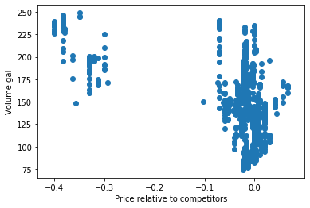
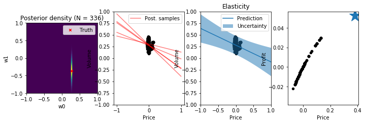

# Methodology for reproducing Exloratory Data Analysis


```python
import pandas as pd 
import numpy as np
import matplotlib.pyplot as plt
from bayesian_linear_regression_util import *
import random
```


```python
%run /home/ec2-user/xxx_old/init_spark.py
```


```python

pd.set_option('display.max_columns', None)
pd.set_option('display.max_rows', 2000)
```

## Create dataframe with the following columns
- FEA_PRICE - Own Store Price
- TGT_VOLUME - Own Store Volume
- ctx_timestamp_adjusted - Timestamp
- fea_competitor_price_1 - Competitors price 1
- fea_competitor_price_2 - Competitors price 2
- fea_competitor_price_3 - Competitors price 3


```python
df = (
    spark
    .read
    .load("s3://pfj-data-science/DataEngg_MCK/Data/05_model_input/MI_TABLE/")
    .withColumnRenamed("TGT_PRICE", "FEA_PRICE")
    .withColumnRenamed("FEA_SALES_QUANTITY", "TGT_VOLUME")
    .withColumn("TGT_VOLUME", F.coalesce("TGT_VOLUME", F.lit(0.0)))
    .withColumnRenamed("fea_timestamp_adjusted", "ctx_timestamp_adjusted")
    .withColumnRenamed("fea_price_1", "fea_competitor_price_1")
    .withColumnRenamed("fea_price_2", "fea_competitor_price_2")
    .withColumnRenamed("fea_price_3", "fea_competitor_price_3")
    .withColumn("FEA_PRICE", F.col("FEA_PRICE").cast("double"))
    .withColumn("fea_competitor_price_1", F.col("fea_competitor_price_1").cast("double"))
    .withColumn("fea_competitor_price_2", F.col("fea_competitor_price_2").cast("double"))
    .withColumn("fea_competitor_price_3", F.col("fea_competitor_price_3").cast("double"))
)
```


```python
def calculate_windows(df_grade):
    columns_to_calculate_lag = ["tgt_volume"]
    select_columns = ["ctx_dim_store_id", "ctx_product_type", "ctx_timestamp_adjusted", "tgt_volume", "fea_price", "fea_competitor_price_1", "fea_competitor_price_2", "fea_competitor_price_3"]
    number_of_days = 7

    window_store_product = Window.partitionBy("CTX_DIM_STORE_ID", "CTX_PRODUCT_TYPE").orderBy("CTX_TIMESTAMP_ADJUSTED")
    window_colums = []
    for col in columns_to_calculate_lag:
        for day in range(1,number_of_days+1):
            window_colums.append(F.lag(col,day*23).over(window_store_product).alias(f"{col}_lag{day}_day".lower().replace("tgt", "fea")))
    return df_grade.select(*(select_columns + window_colums)).toPandas()
```


```python
df_reg_1_store = calculate_windows(df.filter("CTX_PRODUCT_TYPE = 'REG' and CTX_DIM_STORE_ID = 100"))
#df_reg = calculate_windows(df.filter("CTX_PRODUCT_TYPE = 'REG'"))
#df_mid = calculate_windows(df.filter("CTX_PRODUCT_TYPE = 'MID'"))
#df_prem = calculate_windows(df.filter("CTX_PRODUCT_TYPE = 'PREM'"))
```

# Display Table


```python
df_reg_1_store
```


<div>
<style scoped>
    .dataframe tbody tr th:only-of-type {
        vertical-align: middle;
    }

    .dataframe tbody tr th {
        vertical-align: top;
    }

    .dataframe thead th {
        text-align: right;
    }
</style>
<table border="1" class="dataframe">
  <thead>
    <tr style="text-align: right;">
      <th></th>
      <th>ctx_dim_store_id</th>
      <th>ctx_product_type</th>
      <th>ctx_timestamp_adjusted</th>
      <th>tgt_volume</th>
      <th>fea_price</th>
      <th>fea_competitor_price_1</th>
      <th>fea_competitor_price_2</th>
      <th>fea_competitor_price_3</th>
      <th>fea_volume_lag1_day</th>
      <th>fea_volume_lag2_day</th>
      <th>fea_volume_lag3_day</th>
      <th>fea_volume_lag4_day</th>
      <th>fea_volume_lag5_day</th>
      <th>fea_volume_lag6_day</th>
      <th>fea_volume_lag7_day</th>
    </tr>
  </thead>
  <tbody>
    <tr>
      <th>0</th>
      <td>100</td>
      <td>REG</td>
      <td>2016-12-31 00:00:00</td>
      <td>0.000</td>
      <td>NaN</td>
      <td>NaN</td>
      <td>NaN</td>
      <td>NaN</td>
      <td>NaN</td>
      <td>NaN</td>
      <td>NaN</td>
      <td>NaN</td>
      <td>NaN</td>
      <td>NaN</td>
      <td>NaN</td>
    </tr>
    <tr>
      <th>1</th>
      <td>100</td>
      <td>REG</td>
      <td>2016-12-31 01:00:00</td>
      <td>0.000</td>
      <td>NaN</td>
      <td>NaN</td>
      <td>NaN</td>
      <td>NaN</td>
      <td>NaN</td>
      <td>NaN</td>
      <td>NaN</td>
      <td>NaN</td>
      <td>NaN</td>
      <td>NaN</td>
      <td>NaN</td>
    </tr>
    <tr>
      <th>2</th>
      <td>100</td>
      <td>REG</td>
      <td>2016-12-31 02:00:00</td>
      <td>0.000</td>
      <td>NaN</td>
      <td>NaN</td>
      <td>NaN</td>
      <td>NaN</td>
      <td>NaN</td>
      <td>NaN</td>
      <td>NaN</td>
      <td>NaN</td>
      <td>NaN</td>
      <td>NaN</td>
      <td>NaN</td>
    </tr>
    <tr>
      <th>3</th>
      <td>100</td>
      <td>REG</td>
      <td>2016-12-31 03:00:00</td>
      <td>0.000</td>
      <td>NaN</td>
      <td>NaN</td>
      <td>NaN</td>
      <td>NaN</td>
      <td>NaN</td>
      <td>NaN</td>
      <td>NaN</td>
      <td>NaN</td>
      <td>NaN</td>
      <td>NaN</td>
      <td>NaN</td>
    </tr>
    <tr>
      <th>4</th>
      <td>100</td>
      <td>REG</td>
      <td>2016-12-31 04:00:00</td>
      <td>0.000</td>
      <td>NaN</td>
      <td>NaN</td>
      <td>NaN</td>
      <td>NaN</td>
      <td>NaN</td>
      <td>NaN</td>
      <td>NaN</td>
      <td>NaN</td>
      <td>NaN</td>
      <td>NaN</td>
      <td>NaN</td>
    </tr>
    <tr>
      <th>...</th>
      <td>...</td>
      <td>...</td>
      <td>...</td>
      <td>...</td>
      <td>...</td>
      <td>...</td>
      <td>...</td>
      <td>...</td>
      <td>...</td>
      <td>...</td>
      <td>...</td>
      <td>...</td>
      <td>...</td>
      <td>...</td>
      <td>...</td>
    </tr>
    <tr>
      <th>26299</th>
      <td>100</td>
      <td>REG</td>
      <td>2019-12-31 19:00:00</td>
      <td>41.936</td>
      <td>2.419</td>
      <td>2.419</td>
      <td>2.419</td>
      <td>2.459</td>
      <td>57.303</td>
      <td>54.472</td>
      <td>37.308</td>
      <td>22.579</td>
      <td>31.161</td>
      <td>8.200</td>
      <td>0.000</td>
    </tr>
    <tr>
      <th>26300</th>
      <td>100</td>
      <td>REG</td>
      <td>2019-12-31 20:00:00</td>
      <td>62.156</td>
      <td>2.419</td>
      <td>2.419</td>
      <td>2.419</td>
      <td>2.459</td>
      <td>87.557</td>
      <td>83.745</td>
      <td>12.558</td>
      <td>54.524</td>
      <td>0.000</td>
      <td>0.000</td>
      <td>32.982</td>
    </tr>
    <tr>
      <th>26301</th>
      <td>100</td>
      <td>REG</td>
      <td>2019-12-31 21:00:00</td>
      <td>30.831</td>
      <td>2.419</td>
      <td>2.419</td>
      <td>2.419</td>
      <td>2.459</td>
      <td>22.260</td>
      <td>8.268</td>
      <td>77.527</td>
      <td>38.133</td>
      <td>22.831</td>
      <td>14.781</td>
      <td>4.100</td>
    </tr>
    <tr>
      <th>26302</th>
      <td>100</td>
      <td>REG</td>
      <td>2019-12-31 22:00:00</td>
      <td>144.637</td>
      <td>2.419</td>
      <td>2.419</td>
      <td>2.419</td>
      <td>2.459</td>
      <td>8.268</td>
      <td>0.000</td>
      <td>9.098</td>
      <td>18.766</td>
      <td>12.558</td>
      <td>13.064</td>
      <td>29.982</td>
    </tr>
    <tr>
      <th>26303</th>
      <td>100</td>
      <td>REG</td>
      <td>2019-12-31 23:00:00</td>
      <td>0.000</td>
      <td>2.419</td>
      <td>2.419</td>
      <td>2.419</td>
      <td>2.459</td>
      <td>0.000</td>
      <td>8.268</td>
      <td>16.743</td>
      <td>27.324</td>
      <td>59.198</td>
      <td>44.488</td>
      <td>46.129</td>
    </tr>
  </tbody>
</table>
<p>26304 rows × 15 columns</p>
</div>


```python

```


```python
df_reg_1_store['ctx_timestamp_adjusted'][n_min]
```


    Timestamp('2019-05-21 23:00:00')


```python
df_reg_1_store['fea_price'].fillna(0, inplace=True)
df_reg_1_store['fea_competitor_price_1'].fillna(0, inplace=True)
df_reg_1_store['fea_competitor_price_2'].fillna(0, inplace=True)
df_reg_1_store['fea_competitor_price_3'].fillna(0, inplace=True)
```


```python
vol_response = []
delta_price = []
n_future = 24
n_min = random.randint(5000,24000)
# n_max = n_min+ 24*14
n_max = n_min+ 1000

for i in range(n_min,n_max):
#     print(type(df_reg_1_store['fea_price'][i]))
#     print(df_reg_1_store['fea_price'][i])
#     print(type(df_reg_1_store['fea_competitor_price_1'][i]))
#     print(type(df_reg_1_store['fea_competitor_price_2'][i]))
#     print(type(df_reg_1_store['fea_competitor_price_3'][i]))
#     k = df_reg_1_store['fea_price'][i] - (1.0/3.0)*(df_reg_1_store['fea_competitor_price_1'][i] +df_reg_1_store['fea_competitor_price_2'][i]+df_reg_1_store['fea_competitor_price_3'][i])

#     delta_price.append(k)
    future_vol = np.sum(df_reg_1_store['tgt_volume'][i+1:i+1+n_future])/n_future
    vol_response.append(future_vol)
    X_pf = df_reg_1_store['fea_price'][n_min:n_max]- (df_reg_1_store['fea_competitor_price_1'][n_min:n_max]+df_reg_1_store['fea_competitor_price_2'][n_min:n_max]+df_reg_1_store['fea_competitor_price_3'][n_min:n_max])/3.0
    Y_pf = np.asarray(vol_response)
plt.scatter(X_pf, Y_pf)
plt.xlabel('Price relative to competitors')
plt.ylabel('Volume gal')
```


    Text(0, 0.5, 'Volume gal')





```python

 
def posterior(Phi, t, alpha, beta, return_inverse=False):
    """Computes mean and covariance matrix of the posterior distribution."""
    S_N_inv = alpha * np.eye(Phi.shape[1]) + beta * Phi.T.dot(Phi)
    S_N = np.linalg.inv(S_N_inv)
    m_N = beta * S_N.dot(Phi.T).dot(t)
 
    if return_inverse:
        return m_N, S_N, S_N_inv
    else:
        return m_N, S_N
 
 
def posterior_predictive(Phi_test, m_N, S_N, beta):
    """Computes mean and variances of the posterior predictive distribution."""
    y = Phi_test.dot(m_N)
    # Only compute variances (diagonal elements of covariance matrix)
    y_var = 1 / beta + np.sum(Phi_test.dot(S_N) * Phi_test, axis=1)
    
    return y, y_var
 
def f(X, noise_variance):
    '''Linear function plus noise'''
    return f_w0 + f_w1 * X + noise(X.shape, noise_variance)

def g(X, noise_variance):
    '''Sinus function plus noise'''
    return 0.5 + np.sin(2 * np.pi * X) + noise(X.shape, noise_variance)
 
def noise(size, variance):
    return np.random.normal(scale=np.sqrt(variance), size=size)
 
def identity_basis_function(x):
    return x
 
def gaussian_basis_function(x, mu, sigma=0.1):
    return np.exp(-0.5 * (x - mu) ** 2 / sigma ** 2)
 
def polynomial_basis_function(x, degree):
    return x ** degree
 
def expand(x, bf, bf_args=None):
    if bf_args is None:
        return np.concatenate([np.ones(x.shape), bf(x)], axis=1)
    else:
        return np.concatenate([np.ones(x.shape)] + [bf(x, bf_arg) for bf_arg in bf_args], axis=1)
    
def profit(x, m_N):
    return x*m_N[0] + m_N[1]*x**2
def maxUncProfit(m_N):
    return -m_N[0]/(2*m_N[1])
w_0 = 0.
w_1 = 0.0
```


```python
 
# Training dataset sizes
# N_list = [1, 3, 20]
N_list = [336]
 
# beta = 25.0
# alpha = 2.0
 
# Training observations in [-1, 1)
# X = np.random.rand(N_list[-1], 1) * 2 - 1
X = np.asarray(X_pf).reshape(-1, 1)
# Training target values
# t = f(X, noise_variance=1/beta)
t = np.asarray(Y_pf)
 
# Test observations
X_test = np.linspace(-1, 1, 100).reshape(-1, 1)
 
# Function values without noise 
# y_true = f(X_test, noise_variance=0)
    
# Design matrix of test observations
Phi_test = expand(X_test, identity_basis_function)
 
plt.figure(figsize=(10, 3))
plt.subplots_adjust(hspace=4.8)
 
for i, N in enumerate(N_list):
    X_N = X[:N]
    t_N = t[:N]
 
    # Design matrix of training observations
    Phi_N = expand(X_N, identity_basis_function)
    
    # Mean and covariance matrix of posterior
    m_N, S_N = posterior(Phi_N, t_N, alpha, beta)
#     
    # Mean and variances of posterior predictive 
    y, y_var = posterior_predictive(Phi_test, m_N, S_N, beta)
    
    # Draw 5 random weight samples from posterior and compute y values
    w_samples = np.random.multivariate_normal(m_N.ravel(), S_N, 5).T
    y_samples = Phi_test.dot(w_samples)
    
    plt.subplot(len(N_list), 4, i * 4 + 1)
    plot_posterior(m_N, S_N, w_0, w_1)
    plt.title(f'Posterior density (N = {N})')
    plt.tight_layout()
    plt.ylim(-1.0, 1.0)
    plt.legend()
 
    plt.subplot(len(N_list), 4, i * 4 + 2)
    plot_data(X_N, t_N)
#     plot_truth(X_test, y_true)
    plt.ylim(-0.4, 0.4)
    plt.xlim(-0.4, 0.4)
    plt.xlabel("Price")
    plt.ylabel("Volume")
    plt.legend()
 
    plt.subplot(len(N_list), 4, i * 4 + 3)
    plt.title("Elasticity")
    plot_data(X_N, t_N)
#     plot_truth(X_test, y_true, label=None)
    plot_predictive(X_test, y, np.sqrt(y_var))
    plt.xlabel("Price")
    plt.ylabel("Volume")
    plt.ylim(-1., 1.)
    plt.xlim(-1., 1.)
    plt.legend()
    
    plt.subplot(len(N_list), 4, i * 4 + 4)
    plot_data(X_N,profit(X_N, m_N))
    plt.plot(maxUncProfit(m_N),profit(maxUncProfit(m_N), m_N), marker='*', markersize=24)
    plt.xlabel("Price")
    plt.ylabel("Profit")
    w_0 = m_N[0]
    w_1 = m_N[1]
    print('slope is: ',  m_N[1])
```

    slope is:  -0.36027882088323027





```python

```
